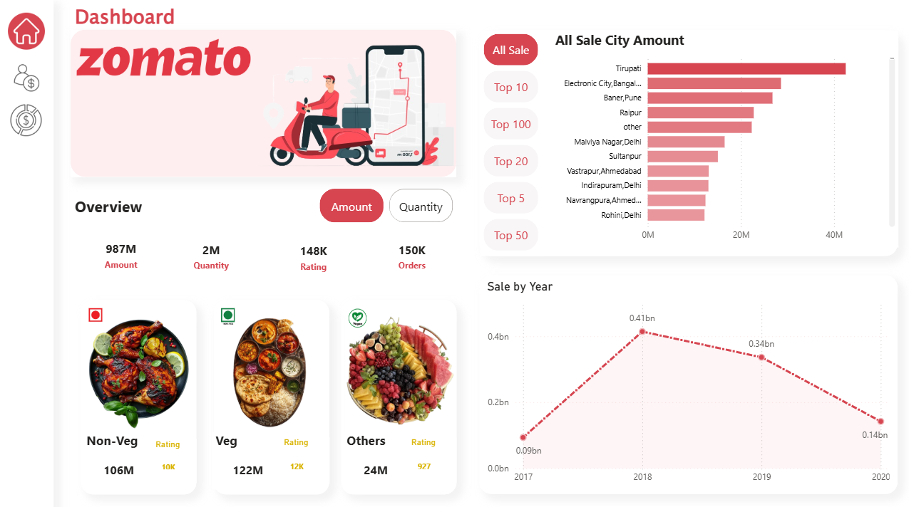
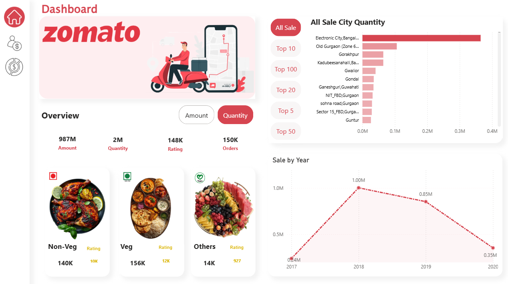

# Beyond the Rating: A Power BI Dive into What Actually Makes a Restaurant Work

> "4.2 stars don't tell you why a restaurant survives. This dashboard does."

## The Story

Everyone looks at a Zomato rating and makes a decision in three seconds. Order or don't. Trust it or scroll past.

But a rating is a summary. It hides the story — the cost that quietly creeps up, the cuisines that get crowded out, the cities where value comes from loyalty and the ones where it comes from sheer frequency. I wanted to see what's underneath the number.

So I built a dashboard that doesn't just display data — it argues with the assumption that a star rating is the full picture.

This project tracks **987M in sales** across **150K orders** and **2M units sold**, giving enough scale to stop guessing and start asking the data direct questions.

## What the Data Actually Said

**Veg wins.**
122M in veg sales against 106M for non-veg. Not what you'd expect walking into the popular narrative around Indian food delivery. Something in the ordering behavior doesn't match the assumption — and that's exactly the kind of gap a dashboard should surface, not smooth over.

**Tirupati leads the city rankings — by amount.**
Not Bangalore. Not Pune. Not Delhi. A temple town, ahead of every metro on this list, driven by a food culture that's overwhelmingly vegetarian by tradition. Suddenly the veg-over-non-veg number isn't a fluke — it's a footprint of *where* the volume is actually coming from. One chart explained the other.

**But flip the lens to quantity, and the answer changes completely.**
Switch from Amount to Quantity, and Tirupati disappears from the top. Electronic City, Bangalore takes over — by a wide margin, nearly double the next city. Old Gurgaon and Gorakhpur show up too, cities that didn't even register in the amount view.

That's the real lesson sitting inside this dashboard: **volume and value tell two different stories.** Tirupati orders less often but spends more per order — loyalty and higher basket size. Bangalore orders constantly, in smaller tickets — frequency and habit. A single "Top City" chart would've hidden this completely. You need both lenses side by side to see how differently people actually behave.

**The timeline tells its own story.**
Sales climbed from 0.09bn in 2017 to a peak of 0.41bn in 2018 — real growth, real momentum. Then it turned. 0.34bn in 2019. 0.14bn by 2020. That's not a dip, that's a business absorbing a shock the whole world felt. The chart doesn't need a caption explaining COVID — the line does it for you.

## What I Built

- **Category-wise breakdown** (Veg / Non-Veg / Others) tied to rating and revenue
- **City-level sales ranking** with dynamic Top 5 / Top 10 / Top 20 / Top 50 / Top 100 slicers
- **Amount ⇄ Quantity toggle** across every visual — because "top" means something different depending on what you're measuring, and the dashboard forces that distinction instead of hiding it
- **Year-over-year sales trend** to expose growth and collapse in one view
- **Clean KPI cards** (Amount, Quantity, Rating, Orders) as the entry point before anyone drills deeper

## Tech Stack

- **Power BI Desktop** — dashboard design, visuals, interactivity
- **Power Query** — data cleaning and transformation
- **DAX** — measures for Amount, Quantity, Rating aggregations behind every visual

## The Real Takeaway

A rating tells you what people think of one plate. This dashboard told me where India's appetite actually lives, what breaks the assumptions we walk in with, how differently value and volume can behave across the same map, and how fast a curve can turn when the world does.

## How to Explore This

1. Download the `.pbix` file from this repo
2. Open in Power BI Desktop
3. Use the **Amount / Quantity** toggle and **Top 5–100** slicers to explore the data from different angles yourself

---

*Part of my data analytics portfolio — built to be interrogated, not just viewed.*
